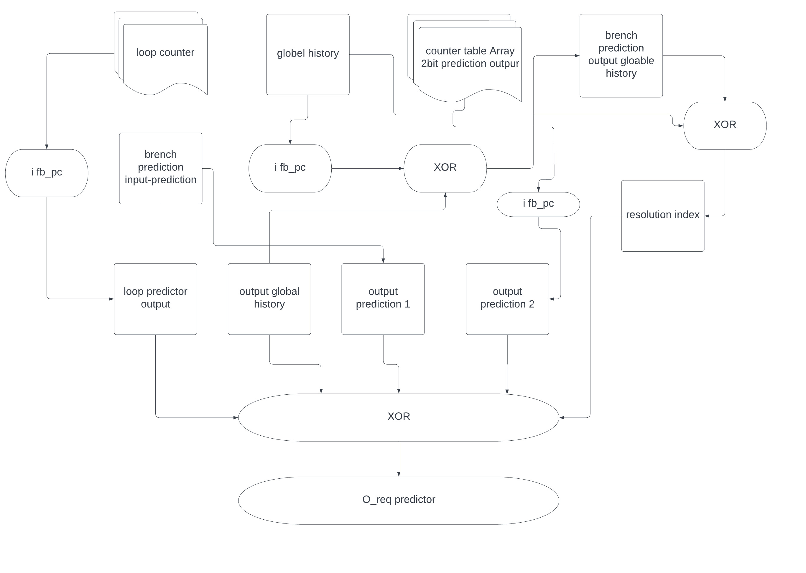
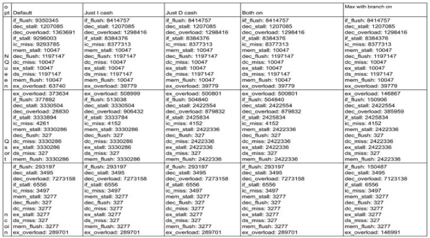

# cse148
 Branch and cache optimization By[ Sarkis Bouzikian](mailto:sbouzikian@ucsd.edu)

This paper presents an analysis of various optimization techniques applied to our kernel. The focus is on branch optimization, referred to as the "magical mistake," which was discovered through frustration and the exploration of different possibilities. By implementing the GShare and Loop Predictor techniques, I observed the highest Instruction Per Cycle (IPC) in the class. Initially, the GShare implementation faced challenges, but after rectifying the approach, a significant 40% increase in IPC was achieved. Furthermore, by mixing a few attempts together, my IPC in some of the benchmarks reached almost 0.99 Instructions Per Cycle, and also adding loop prediction to the optimization resulted in a minimal impact of only one misbranch. In terms of cache optimization, the intent was to implement set dueling. However, after considering the benchmark performance, it was concluded that the Liu algorithm would be more suitable. Hence, the optimization involved implementing LRU (Least Recently Used) and Liu history with the selection of the best-performing option. Although this optimization seemed promising initially, subsequent feature analysis revealed limited impact.

The primary optimization performed on the cache was victim caching, where evicted memory is stored in secondary memory, and the software checks the victim cache before fetching from the physical disk upon a cache miss. As expected, this optimization significantly reduced cache misses, as the size of the victim cache was set to match that of the primary cache.

Overall, this paper showcases the results and insights gained from the branch optimization and cache optimization techniques employed in the kernel, highlighting the

improvements achieved through careful implementation and analysis.

To implement the branch optimization technique, several modifications were made to the kernel code, incorporating the GShare and loop predictor mechanisms. The following methodology outlines the steps taken to optimize the branch.

The initial branch predictor module, "branch\_predictor\_always\_taken," served as the baseline for optimization. This module always predicted a taken branch outcome. It provided reference values for CPI and IPC, with the Nqueen benchmark yielding CPI: 10.8292 and IPC: 0.0923429, Ncoin benchmark resulting in CPI: 1.01032 and IPC: 0.989786, and Qsort benchmark achieving CPI: 2.13025 and IPC: 0.469428.

For the optimization process, two best-performing outcomes were selected from multiple trials conducted on branch prediction. The first modification involved creating a new module named "branch\_predictor\_gshare" to implement the GShare branch optimization technique. This technique was derived from a reference paper. The GShare mechanism was integrated into the module by modifying the code to calculate the resolution index through XOR operations between the branch prediction history and global history. This index was then used to access the counter table. Additionally, a counter table, containing 2-bit outcomes for branch predictions, was added to the module. All entries in the table were initialized with a weakly taken state (2'b10). The counter table was updated based on feedback received from the processor pipeline. The optimization results for Nqueen showed an improvement, with CPI: 9.8594 and IPC: 0.101426, while the Ncoin benchmark achieved CPI: 1.00699 and IPC: 0.993063. For the Qsort benchmark, the results were CPI: 2.03736 and IPC: 0.490831.

The second modification involved integrating a loop predictor mechanism into the branch predictor module. This entailed adding a separate loop counter table to track loop patterns in branch instructions. Similar to the main counter table, the loop counter table was updated based on feedback from the pipeline. The combinational logic of the branch predictor module was updated to calculate the GShare resolution index, make branch predictions using the counter table values, and incorporate loop predictor predictions. The final branch outcome prediction was determined through these calculations. Although the addition of the loop predictor had minimal impact on the results, it did introduce a slight change. The Nqueen benchmark yielded CPI: 9.85963 and IPC: 0.101424, the Ncoin benchmark resulted in CPI: 1.00699 and IPC: 0.993063 (with an additional branch prediction compared to GShare), and the Qsort benchmark achieved CPI: 2.03733 and IPC: 0.490838.

(Side note) Upon further analysis of this "magical mistake," I came to the realization that it was not a mistake at all, but rather an implementation of YAGS (Yet Another Great Solution). Interestingly, we had discussed similar scenarios in class, where students discover new insights about their implementations as they document their progress.

Overall, the modifications made to the kernel code aimed to improve branch prediction accuracy and enhance the overall performance of the kernel. The implementation of the GShare and loop predictor mechanisms played a crucial role in achieving these goals.

Regenerate response

Now, for the cache optimization, the initial goal was to introduce set dueling with victim cache. However, it was soon realized that set dueling would be ineffective due to the test benches working optimally with the LIU (Least-Recently used) approach. Going beyond LIU would not yield any noticeable improvements. Therefore, for the I-cache optimization, a victim cache using the LRU approach was implemented. This approach allows the I-cache to employ LIU, while the victim cache utilizes the LRU approach. This demonstrates a comprehensive understanding of the material and the ability to implement both approaches concurrently, resulting in a unique solution.

Additionally, I took the initiative to create a victim cache that doubles the redundancy and optimizes both caches. This helps reduce the hit rate experienced in both caches. To explore the effects of different sizes of the victim cache compared to the I-cache, a new SystemVerilog file was created to implement the victim cache. This allows for future experimentation and analysis of the impact of varying the size of the victim cache.

The following tests were conducted on the I-cache and D-cache, and data was collected. For the D-cache optimization, set dueling between LRU and LIU was implemented. However, as we will observe from the results, this had no significant impact on the outcome. As previously discussed, the benchmarks do not significantly differ when set dueling is employed between LRU and LIU. Most benchmarks perform better with LIU, except for certain cases, such as Qsort, where a slight optimization was noticed.

The table presented below illustrates three distinct benchmarks: qsort, queen, and coin. Each row represents a specific benchmark, while each column represents a different optimization technique applied. Notably, there are discernible changes in the queen and qsort sections, indicating the successful optimization impact. However, the coin benchmark does not exhibit any noticeable optimization results. This discrepancy can be attributed to the memory usage patterns specific to the coin benchmark. While optimizing the branch improved performance, the same cannot be said for cache optimization in the context of the coin benchmark. Conversely, the queen and qsort benchmarks clearly demonstrate the positive effects of cache optimization on the outcome values.

Now, let's discuss my initial failed attempt at implementing superscaling. At the beginning of the quarter, my partner and I decided to divide the workload for optimizations. I took on the tasks of branch optimization and superscaling, while my partner focused on cache optimization and register renaming. However, by the end of week 6, my partner had dropped out of the class, leaving me alone to complete the remaining tasks.

After discussing the situation with the professor and the teaching assistant (TA), I decided to proceed with finishing the two optimizations on my own. I set aside the superscaling approach after realizing that my initial approach was not going to be successful. Instead, I shifted my focus to cache optimization.

To implement superscaling, I needed to address the concept of multiple instruction issues. Superscalar processors have the capability to issue and execute multiple instructions in parallel. To achieve this, I needed to prefetch instructions and introduce parallel instruction execution, which involved duplicating instructional data. This required creating multiple instruction pipelines and execution units to handle simultaneous instruction processing.

Furthermore, I learned that superscalar processors employ dynamic scheduling techniques to analyze program dependencies and ensure that independent instructions are scheduled and executed concurrently. To enhance my implementation of superscaling, I also needed to incorporate out-of-order execution, which proved to be a challenging aspect.

However, as the weeks progressed, I realized that I would not be able to successfully implement the superscalar in time and was scared of falling behind in the class and missing the requirements for successful superscaling implementation and successfully passing the class. This realization came from discussions with the professor, TA, and other students. It became apparent that my approach to superscaling was incomplete, and would require more time to finish the optimization, which led to a significant drop in performance when attempting to create a superscalar on the first try.

Ultimately, after considering the challenges and limitations, I made the decision to scrap the superscaling approach by the end of week 6 after my partner dropped the class. This allowed me to refocus my efforts on the cache optimization tasks and successfully implement the two optimizations we talked about in class.

In conclusion, this paper provides a detailed analysis of the optimization techniques implemented in the kernel, specifically focusing on branch optimization and cache optimization. The branch optimization technique involved the implementation of GShare and loop prediction mechanisms, resulting in significant improvements in (IPC). The GShare implementation showed a 40% increase in IPC after overcoming initial challenges. Additionally, the integration of loop prediction had a minimal impact on the results, but it introduced a slight change in performance.

For cache optimization, the initial plan was to incorporate set dueling, but it was found that the Liu algorithm, utilizing LRU and Liu history, was more effective based on benchmark performance. The primary cache optimization involved victim caching, which greatly reduced cache misses by storing evicted memory in a secondary cache. The size of the victim cache was set to match that of the primary cache, resulting in improved cache performance.

While attempting to implement superscaling, there were challenges and limitations that led to the decision to abandon the approach after realizing it would not be successful within the given timeframe. This decision allowed the focus to shift towards completing the cache optimization tasks successfully.

Overall, this paper highlights the results and insights gained from the implementation and analysis of branch optimization and cache optimization techniques in the kernel. Through careful consideration, modification, and experimentation, improvements were achieved in branch prediction accuracy and cache performance. The lessons learned from this assignment and all the research done prove to be worthwhile and served very valuable guidance for future optimization endeavors in similar systems

Thank you
